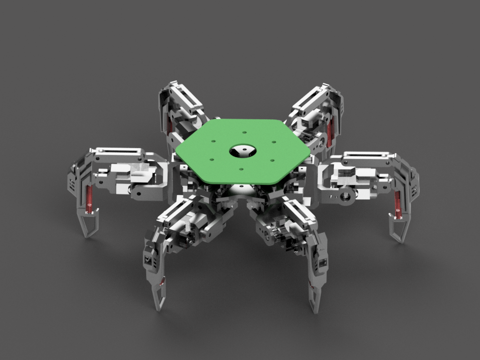
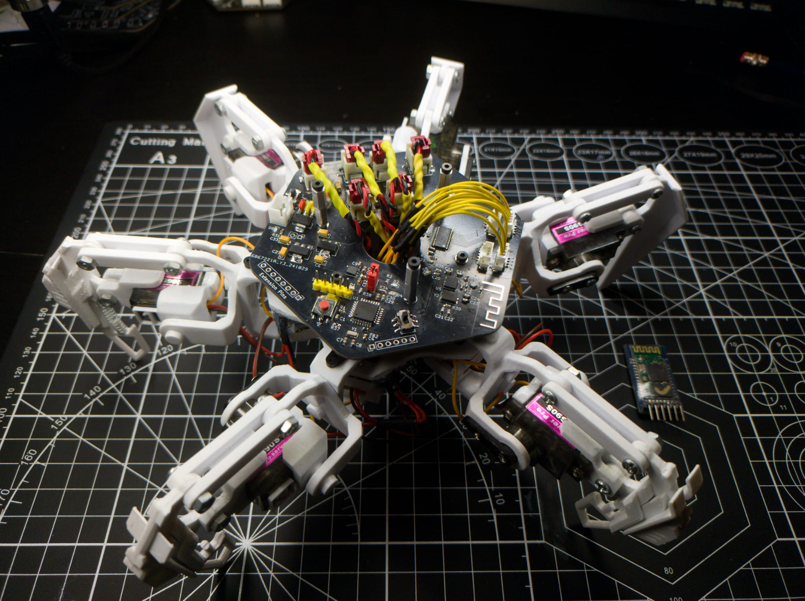
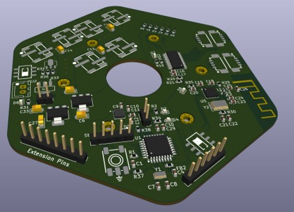
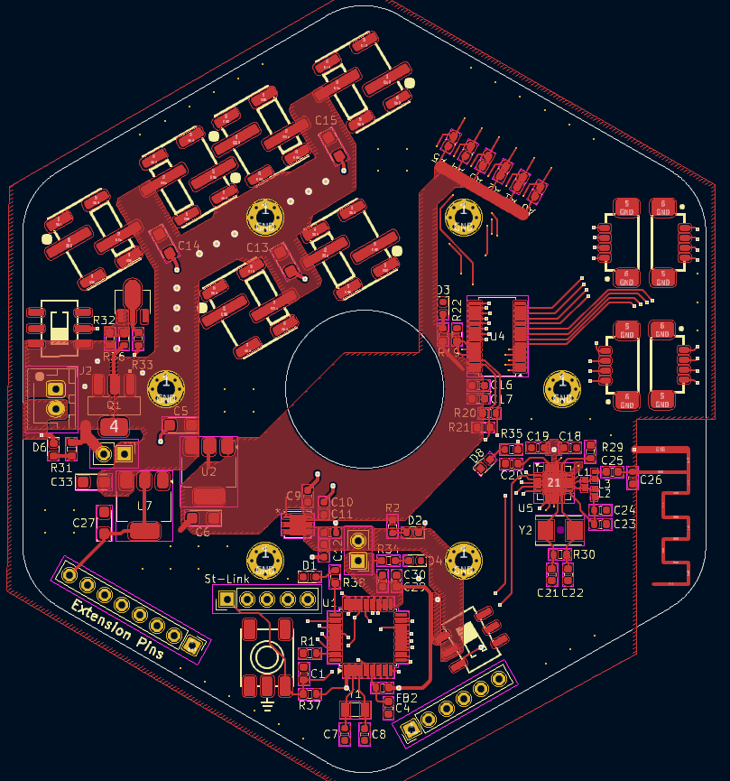
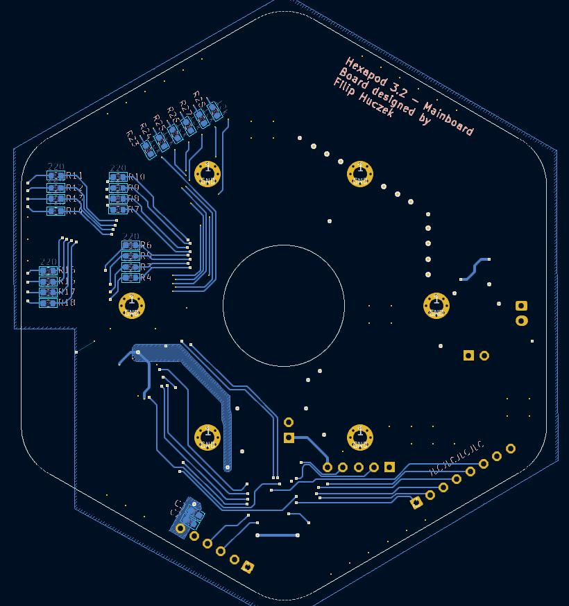
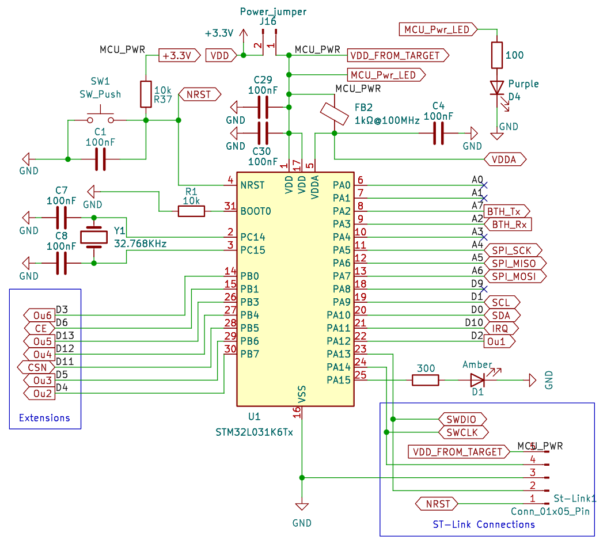
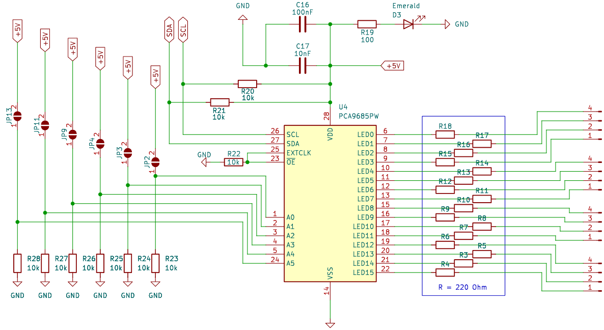
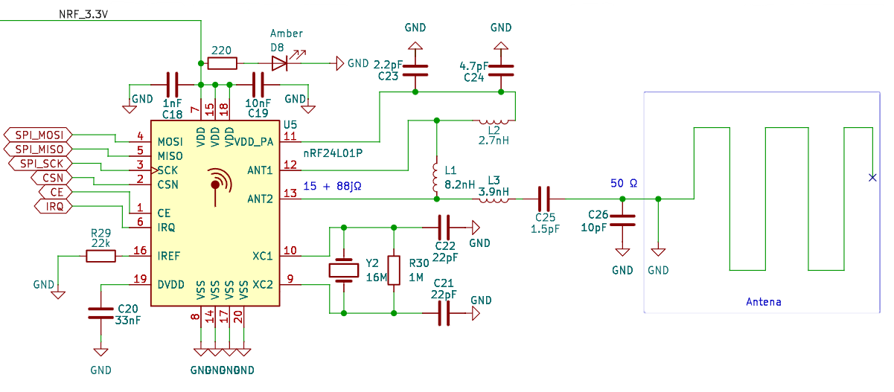
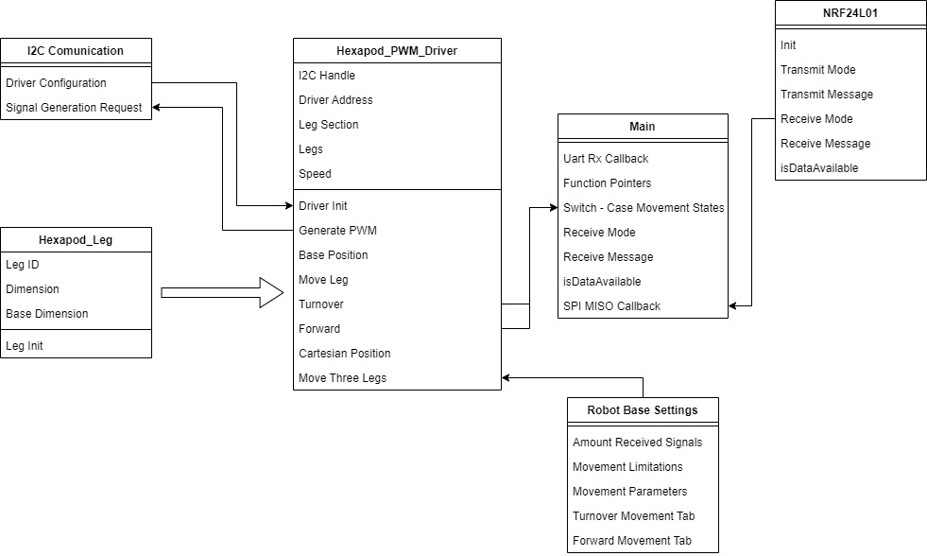

## 
Hexapod Based on STM32 Microcontroller

Designed and built for an engineering thesis, this six-legged walking robot is controlled via Bluetooth or an nRF module. As part of the project, a PCB was designed and fabricated, and the software was developed. The robot's structure was 3D printed.

The repository includes KiCad files for the PCB and a project in STM Cube IDE.

### Components used:

- <b>Microcontroller:</b> STM32 L031K6T6

- <b>PWM Driver:</b> PCA9685PW

- <b>Bluetooth:</b> HC-05

- <b>nRF:</b> NRF24L01+ 2.4GHz

- <b>Buck Converters:</b> 8.4V → 6V

- <b>Transistors, Regulators, resistors, capacitors and other primary electronic components</b>

- <b>PWM Servos:</b> MG90S

### 
Software 

The software operates through communication via I2C, SPI, and UART with the respective components: the PWM driver, nRF module, and Bluetooth. The software includes an algorithm responsible for moving the robot's legs in Cartesian space. The robot is capable of moving forward, backward, and rotating.

### Software Structure:

